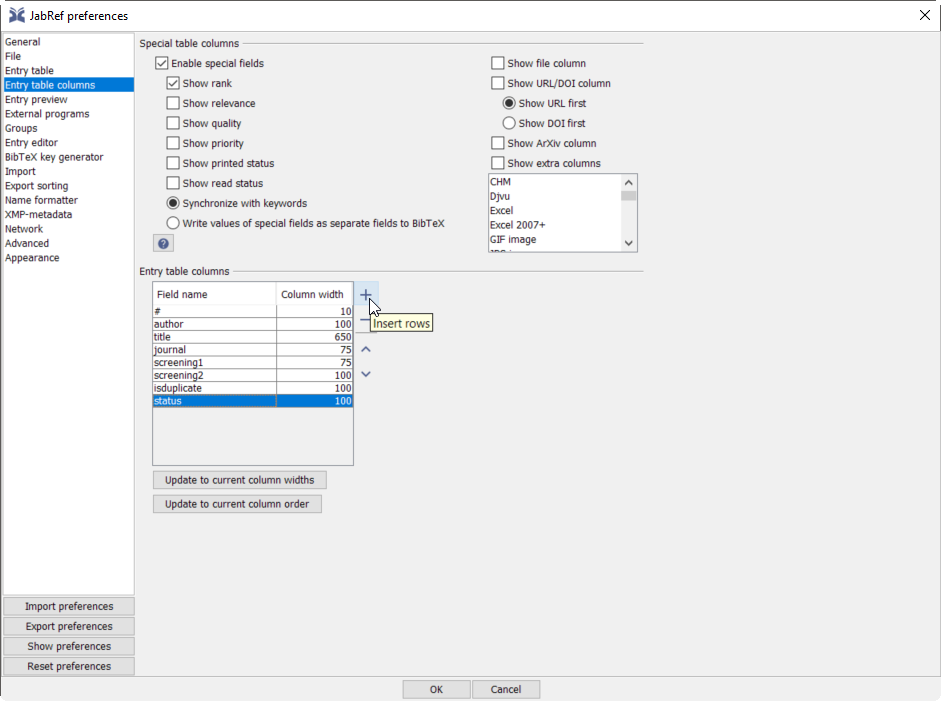
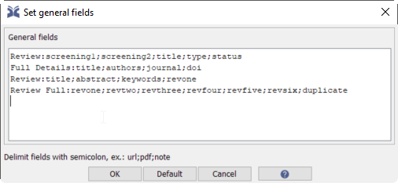

```{r setup, include=FALSE}
########################################################################
### Load packages
########################################################################

require('userfriendlyscience');  ### For convenience functions, e.g. 'safeRequire'
safeRequire('here');             ### To easily access files using 'relative paths'
safeRequire('plyr');             ### For easily processing and restructuring data
safeRequire("googlesheets");     ### To import data from google sheets in metabefor
safeRequire('jsonlite');         ### To import a list of country codes in metabefor
safeRequire('data.tree');        ### To work with data structured in a tree in metabefor
safeRequire('devtools');         ### To install metabefor from github repo
                                 ### ... Which we then do here:
devtools::install_github("Matherion/metabefor");
require('metabefor');

########################################################################
### Settings
########################################################################

### By default hide R code
knitr::opts_chunk$set(echo = FALSE);

### Set path for query hit exports
queryHitExportPath <- here::here("queries");

### Set path for screening
screeningPath <- here::here("screening");

### Set path for extraction script template
extractionScriptTemplatePath <- here::here("extraction");

```

## First query, executed at: 2018-05-14

The first query is:

```
("Home advantage" OR "home court advantage" OR "home team advantage" OR "home venue advantage" OR "home field advantage") AND ("soccer" OR "football") NOT ("American Football" NOT "Australian football") 
```

This was run at 2018-05-14 in PubMed (53 hits) and PsycINFO accessed through EbscoHost (63 hits), and exported to csv, RIS (called 'medline' in PubMed) and bibtex (from PsycINFO) formats. The RIS files were then imported in R using `metabefor`.

```{r echo=TRUE}

### Import PsycINFO hits
firstQueryIteration_psycinfo <-
  importRISlike(file.path(queryHitExportPath,
                          "psycinfo-2018-05-14.ris"),
                encoding="native.enc");

### Import PubMed hits
firstQueryIteration_pubmed <-
  importRISlike(file.path(queryHitExportPath,
                          "pubmed-2018-05-14.ris"));

### Merge the two sets of hits
firstQueryIteration <-
  findDuplicateReferences(primaryRefs = firstQueryIteration_psycinfo,
                          secondaryRefs = firstQueryIteration_pubmed,
                          duplicateFieldValue = "dupl",
                          newRecordValue = "PubMed",
                          duplicateValue = "duplicate (both PsycINFO and PubMed)",
                          originalValue = "PsycINFO");

### Generate bibtex keys
firstQueryIteration$output$records <-
  generateBibtexkeys(firstQueryIteration$output$records);

### Add query date identifier to bibtex keys
firstQueryIteration$output$records$bibtexkey <-
  paste0(firstQueryIteration$output$records$bibtexkey,
         "-20180514");

### Export the hits to bibtex for screening in JabRef
sysrevExport(firstQueryIteration,
             filename=file.path(screeningPath,
                                "2018-05-14-screening.bib"),
             screeningType="screening");

```

The merged list of query hits has now been exported to file `2018-05-14-screening.bib` in directory "screening" and can be opened using JabRef, which can be downloaded from https://www.fosshub.com/JabRef.html.

## JabRef configuration

When opening a bibliographic library (i.e. a file with the extension `.bib`) in JabRef, it will show the entry table, which is a convenient way to inspect all entries (hits, references, articles, etc) in the library. To prepare JabRef for screening, two settings are important.

First, to change the fields that are visible in the overview table of all references (i.e. the entry table), open the 'Options' drop-down menu and select 'Preferences'. In the preferences dialog, open the 'Entry table columns' section:



There, the columns shown in the entry table can be edited in the 'Entry table columns' sections. A bit confusingly, this is done by adding *rows* in the table shown in this dialog. Each 'row' in this table represents a column in the entry table.

Note that in bibtex (and therefore JabRef), you can create new fields on the fly. In this case, use field 'screening1' for screening the hits of this first screening iteration: simply add this field name as a 'row' (column) in the entry table. This will show, for every entry, the contents of that field (if it has any).

Second, you need to be able to edit the content in that field. The entry table is very convenient to maintain an overview of the entries in the database, but cannot be used for editing. To edit an entry, double click it in the entry tabel. This opens the entry editor, which has a number of tabs. Each tab shows a number of fields which can then be edited.

These tabs can be configured by setting the 'General fields'. Open the 'Options' drop-down menu and select 'General Fields' to configure which fields are available in the different tabs when opening an entry. 



Add a dedicated field for the reviewing, showing only the title, abstract, and `screening1` fields. This allows you to focus on the relevant information while ignoring irrelevant and potentially biasing information (such as year, journal, and authors). Each row in this text area shows one tab. The first term on each row is the tab's name, followed by a colon (`:`) and then the fields shown in the tab, separated by semicolons (`;`). For example, you could add the following row:

`Screening Round 1:title;abstract;screening1`

## Screening process

For every entry, add the following text in the 'screening' field:

- If it is excluded, add the reason, specifically (these are ordered progressively; i.e. if one of the criteria matches, apply it and move on to the next entry):
    - **`nohome`** if the study does not deal with the home advantage;
    - **`nosoccer`** if the study does not report on data exclusively for soccer (*also* reporting data for other sports is no grounds for exclusion of course)
    - **`nopro`** if the study does not report on data exclusively for professionals (*also* reporting data for amateur soccer is no grounds for exclusion of course)
- If it is included, add **`incl`**, followed by two opening brackets (**`[[`**) and a list of the relevant variables that were included separated by pipes (**`|`**) and terminated by two closing brackets (**`]]`**), such as `incl [[ supporting audience size | distance from home city ]]`

So once JabRef is opened, when screening, make sure that the 'screening1' field is shown in the entry table (i.e. that it is one of the entry table columns), and create one entry editing tab using 'General Fields' that contains the fields `title`, `abstract`, and `screening1`. You can then use this tab for the screening. It is also convenient to show field `dupl` in either the entry table or the screening tab in the entry editor, because for duplicate records (that were identified as such - the algorithm may miss some duplicates of course), that field contains the text `dupl`.

Make sure to save the database with query hits under a different name than "2018-05-14-screening.bib". That is important because file "2018-05-14-screening.bib" will get overwritten if this R Markdown file is executed again.

## Second query, executed at: 2018-05-23

The query was updated to:

```
("Home advantage" OR "home court advantage" OR "home team advantage" OR "home venue advantage" OR "home field advantage" OR "game location") AND ("soccer" OR "football") NOT ("American Football" OR "Australian football") 
```

This was run at 2018-05-23 in PubMed (61 hits) and PsycINFO accessed through EbscoHost (72 hits), and exported to the RIS format (called 'medline' in PubMed). The RIS files were then imported in R using `metabefor`.

```{r echo=TRUE}

### Import PsycINFO hits
secondQueryIteration_psycinfo <-
  importRISlike(file.path(queryHitExportPath,
                          "psycinfo-2018-05-23.ris"),
                encoding="native.enc");

### Import PubMed hits
secondQueryIteration_pubmed <-
  importRISlike(file.path(queryHitExportPath,
                          "pubmed-2018-05-23.ris"));

### Merge the two sets of hits
secondQueryIteration <-
  findDuplicateReferences(primaryRefs = secondQueryIteration_psycinfo,
                          secondaryRefs = secondQueryIteration_pubmed,
                          duplicateFieldValue = "dupl (2nd)",
                          newRecordValue = "PubMed (2nd)",
                          duplicateValue = "duplicate (both PsycINFO and PubMed; 2nd)",
                          originalValue = "PsycINFO (2nd)");

### Generate bibtex keys
secondQueryIteration$output$records <-
  generateBibtexkeys(secondQueryIteration$output$records);

### Add query date identifier to bibtex keys
secondQueryIteration$output$records$bibtexkey <-
  paste0(secondQueryIteration$output$records$bibtexkey,
         "-20180523");

### Import results from first query (these have been screened now)
firstQueryIteration_screened <-
  importBibtex(file.path(screeningPath,
                         "2018-05-14-screening#1.bib"));

### Merge the screened reference database from the first query
### with the database from the second query
secondQueryIteration_merged <-
  findDuplicateReferences(primaryRefs = firstQueryIteration_screened,
                          secondaryRefs = secondQueryIteration,
                          duplicateFieldValue = "Screened in first iteration",
                          newRecordValue = "From second query",
                          duplicateValue = "From first query (screened in first iteration)",
                          originalValue = "screening1");

### The new records are stored in secondQueryIteration_merged$output$newRecords, so we
### can copy these to the database from the first screening. We also store the entire
### database so that we can document the process (and if need be, check whether anything
### went wrong).

secondScreening <- firstQueryIteration_screened;

secondScreening$output$records <- rbind.fill(secondScreening$output$records,
                                             secondQueryIteration_merged$output$newRecords);

### Export the hits to bibtex for screening in JabRef
sysrevExport(secondQueryIteration_merged,
             filename=file.path(screeningPath,
                                "2018-05-23-fully-merged-database.bib"),
             screeningType="screening");

sysrevExport(secondScreening,
             filename=file.path(screeningPath,
                                "2018-05-23-screening.bib"),
             screeningType="screening");

```

The merged bibliographic database has been stored in the screening path (`r screeningPath`), to file `2018-05-23-screening.bib`. This file can now be opened in JabRef, and should be saved to a different filename before any edits are made (because, after all, the file named `2018-05-23-screening.bib` will be overwritten every time this script runs).

In this merged database, field 'screening1' has been preserved. Records where this field is empty, therefore, are from the second query, and should be screened in the second screening sweep.

## Generation of the Extraction Script

We will use a metabefor extraction script for the extraction of the data. The idea of this script is to extract the data from the original sources with a minimum of interpretation. The data is extracted into a machine-readable format, which then allows competely transparent further processing and synthesis.

These scripts are generated on the basis of two tables/spreadsheets. The first contains the entities to extract, such as study year, sample size, how variables were operationalised, and associations that were found. The second contains the valid values for each entity, to allow efficiently providing coders with examples, instructions, and to allow easy verification of the input.

```{r extraction-script-generation}

sheetsURL <- paste0("https://docs.google.com/spreadsheets/d/",
                    "1S14aH6ng7_e9wkNTT4zJZCiWNhAbk5vGLM78OHdFPYE");

valueTemplatesSheet <- "valueTemplates";
entitiesSheet <- "entities";

rxs_fromSpecifications(gs_url = sheetsURL,
                       entitiesFilename = file.path(extractionScriptTemplatePath,
                                                    "entities-local-copy.csv"),
                       valueTemplatesFilename = file.path(extractionScriptTemplatePath,
                                                          "valueTemplates-local-copy.csv"),
                       gs_localBackup = list(entities = file.path(extractionScriptTemplatePath,
                                                                  "entities-local-copy.csv"),
                                             valueTemplates= file.path(extractionScriptTemplatePath,
                                                                       "valueTemplates-local-copy.csv"),
                                             definitions = NULL),
                       outputFile = file.path(extractionScriptTemplatePath,
                                              "extractionScriptTemplate.rxs.Rmd"));

```
